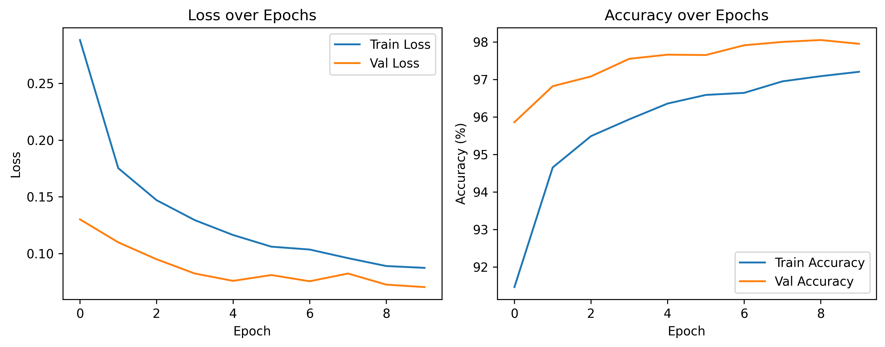

# Project 1: Multi-Layer Perceptron on MNIST

A from-scratch implementation of a Multi-Layer Perceptron (MLP) for handwritten digit classification on the MNIST dataset.

## 🎯 Objective

Build a flexible MLP architecture that accepts arbitrary hidden layer configurations, implementing all core PyTorch training mechanics manually without using pre-built training loops or high-level abstractions.

## 🏗️ Architecture

### Model Design

```python
MLP(
  input_size=784,           # 28x28 flattened images
  hidden_sizes=[256, 128],  # Two hidden layers
  num_classes=10,           # 10 digit classes (0-9)
  dropout_p=0.3             # Dropout rate
)
```

**Layer Structure:**

1. `Flatten` → Converts (batch, 1, 28, 28) to (batch, 784)
2. `Linear(784, 256)` → First hidden layer
3. `ReLU + BatchNorm1d(256) + Dropout(0.3)`
4. `Linear(256, 128)` → Second hidden layer
5. `ReLU + BatchNorm1d(128) + Dropout(0.3)`
6. `Linear(128, 10)` → Output layer (logits)

**Key Features:**

- **Dynamic construction:** Accepts any list of hidden layer sizes
- **Regularization:** Batch normalization and dropout prevent overfitting
- **Modularity:** Clean separation between model definition and training

### Why This Architecture?

- **Flatten layer:** MNIST images are 2D, but MLPs require 1D input
- **Two hidden layers:** Sufficient depth for MNIST while remaining simple
- **Decreasing hidden sizes (256→128):** Common pattern for funneling information to output
- **BatchNorm after ReLU:** Normalizes activations for stable training
- **Dropout 0.3:** Prevents co-adaptation of neurons, improves generalization

## 📊 Results



### Final Performance

| Metric       | Training | Validation |
| ------------ | -------- | ---------- |
| **Accuracy** | 97.9%    | 98.3%      |
| **Loss**     | 0.063    | 0.062      |

### Training Details

- **Epochs:** 10
- **Total time:** 1 min (GPU)
- **Total parameters:** ~238k
- **Convergence:** Stable after epoch 5

### Key Observations

1. **Validation > Training accuracy:** Unusual but explainable
   - Dropout is **active** during training (randomly drops 30% of neurons)
   - Dropout is **disabled** during validation (uses full network capacity)
   - Result: Validation sees a "stronger" network

2. **Loss curve behavior:**
   - Train loss decreases monotonically
   - Val loss has minor oscillations (epochs 2-4) — normal for small datasets
   - No divergence → no overfitting

3. **Convergence speed:**
   - Major improvement in first 3 epochs
   - Plateaus around epoch 5-6
   - Could benefit from learning rate scheduling for further gains

## 🛠️ Implementation Details

### Data Pipeline

```python
transform = transforms.Compose([
    transforms.ToTensor(),                    # Convert PIL → Tensor, scale to [0,1]
    transforms.Normalize((0.1307,), (0.3081,))  # Normalize to mean=0, std=1
])
```

**Why normalize?**

- MNIST pixel values are in [0, 1] after `ToTensor()`
- Mean ≈ 0.13 (many black pixels from background)
- Normalizing centers data around 0 → faster/more stable training

**DataLoader settings:**

- `batch_size=64`: Good balance between speed and generalization
- `shuffle=True` for training: Prevents learning order-dependent patterns
- `shuffle=False` for validation: Reproducible results

### Training Loop

```python
for epoch in range(num_epochs):
    # Training phase
    model.train()  # Enable dropout, batch norm in training mode
    for images, labels in train_loader:
        optimizer.zero_grad()       # Reset gradients
        outputs = model(images)     # Forward pass
        loss = criterion(outputs, labels)
        loss.backward()             # Compute gradients
        optimizer.step()            # Update weights

    # Validation phase
    model.eval()  # Disable dropout, batch norm uses running stats
    with torch.no_grad():  # Disable gradient computation
        # ... validation logic
```

**Critical details:**

- `optimizer.zero_grad()` **must** be called before each backward pass (gradients accumulate by default)
- `model.train()` vs `model.eval()` affects dropout and batch norm behavior
- `torch.no_grad()` during validation saves memory and speeds up inference

### Hyperparameters

| Parameter     | Value            | Justification                                             |
| ------------- | ---------------- | --------------------------------------------------------- |
| Learning Rate | 0.001            | Adam default, works well for most cases                   |
| Optimizer     | Adam             | Adaptive learning rates, robust to hyperparameter choices |
| Loss Function | CrossEntropyLoss | Standard for multiclass classification                    |
| Batch Size    | 64               | Balances GPU memory and gradient noise                    |
| Hidden Layers | [256, 128]       | Sufficient capacity for MNIST complexity                  |
| Dropout       | 0.3              | Moderate regularization, common default                   |

## 🔧 Running the Code

### Prerequisites

```bash
uv sync
cd pytorch-fundamentals/01_mlp_mnist
```

### Option 1: Jupyter Notebook (Recommended)

```bash
jupyter notebook notebooks/train.ipynb
```

### Option 2: Python Script

```python
from models.mlp import MLP
from shared.utils.trainer import train_one_epoch, validate
import torch
from torchvision import datasets, transforms
from torch.utils.data import DataLoader

# Setup
device = torch.device('cuda' if torch.cuda.is_available() else 'cpu')
model = MLP(784, [256, 128], 10, dropout_p=0.3).to(device)

# Data
transform = transforms.Compose([
    transforms.ToTensor(),
    transforms.Normalize((0.1307,), (0.3081,))
])
train_data = datasets.MNIST('data', train=True, download=True, transform=transform)
train_loader = DataLoader(train_data, batch_size=64, shuffle=True)

# Train
criterion = torch.nn.CrossEntropyLoss()
optimizer = torch.optim.Adam(model.parameters(), lr=0.001)

for epoch in range(10):
    train_loss, train_acc = train_one_epoch(model, train_loader, criterion, optimizer, device)
    print(f"Epoch {epoch+1}: Loss={train_loss:.4f}, Acc={train_acc:.2f}%")
```

## 🧠 What I Learned

### PyTorch Mechanics

- **Autograd:** How `loss.backward()` builds the computational graph and propagates gradients
- **Device management:** Moving tensors/models between CPU and GPU with `.to(device)`
- **Module modes:** The importance of `model.train()` vs `model.eval()` for proper batch norm/dropout behavior
- **Gradient zeroing:** Why `optimizer.zero_grad()` is necessary (gradients accumulate by default)

### Design Patterns

- **Modular architecture:** Separating model definition (`models/`), training logic (`utils/`), and experiments (`notebooks/`)
- **Dynamic layer construction:** Using loops to build arbitrarily deep networks
- **Metric tracking:** Accumulating batch-level metrics to compute epoch-level averages

### Deep Learning Concepts

- **Normalization matters:** Even for "simple" datasets, normalizing inputs speeds up convergence
- **Dropout regularization:** How to interpret validation accuracy > training accuracy
- **Batch normalization:** Stabilizes training by normalizing intermediate activations

## 🔮 Future Improvements

- [ ] **Learning rate scheduling:** Use ReduceLROnPlateau to improve convergence
- [ ] **Early stopping:** Stop training when validation loss stops improving
- [ ] **Model checkpointing:** Save best model during training
- [ ] **Confusion matrix:** Analyze which digits are most confused
- [ ] **Architecture search:** Try different hidden layer configurations
- [ ] **Visualization:** Plot learned weights of first layer

## 📚 References

- [MNIST Dataset](http://yann.lecun.com/exdb/mnist/)
- [Batch Normalization (Ioffe &amp; Szegedy, 2015)](https://arxiv.org/abs/1502.03167)
- [Dropout (Srivastava et al., 2014)](https://jmlr.org/papers/v15/srivastava14a.html)
- [Adam Optimizer (Kingma &amp; Ba, 2014)](https://arxiv.org/abs/1412.6980)

---

[← Back to main repository](../README.md)
