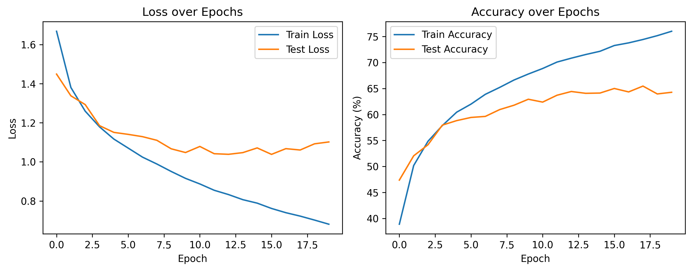
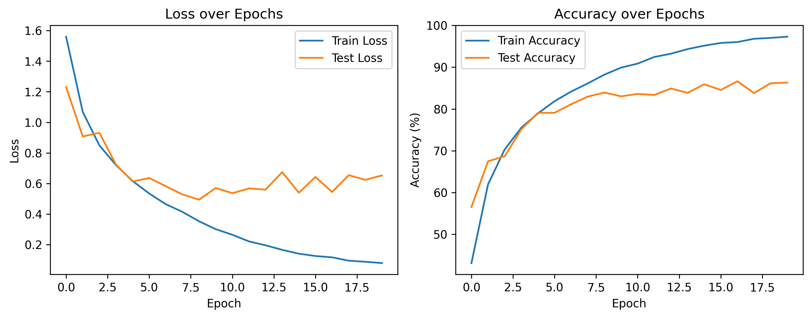

# Project 2: Convolutional Neural Networks on CIFAR-10

From-scratch implementation of two CNN architectures for image classification on CIFAR-10: the classic LeNet-5 and a modern CustomCNN with batch normalization and dropout.

## 🎯 Objective

Understand the fundamentals of convolutional neural networks by implementing:

1. **LeNet-5** — Classic architecture from 1998 (adapted for RGB images)
2. **CustomCNN** — Modern architecture with BatchNorm, deeper layers, and regularization

Compare their performance to understand the impact of architectural improvements over the past 25 years.

## 🏗️ Architectures

### LeNet-5 (Adapted)

```
Input: 32×32×3

Conv1: 3→6 channels, kernel=5, stride=1    → 28×28×6
ReLU + MaxPool(2×2)                        → 14×14×6

Conv2: 6→16 channels, kernel=5, stride=1   → 10×10×16
ReLU + MaxPool(2×2)                        → 5×5×16

Flatten → 5×5×16 = 400

FC1: 400→120 + ReLU
FC2: 120→84 + ReLU
FC3: 84→10
```

**Parameters:** ~62,000

**Key features:**

- Simple architecture with only 2 convolutional layers
- No regularization beyond the inherent sparsity of convolutions
- Minimal capacity for complex feature extraction

### CustomCNN (Modern)

```
Block 1: 3→64→64 channels, 32×32 → 16×16
  Conv(3→64, k=3, p=1) → BatchNorm → ReLU
  Conv(64→64, k=3, p=1) → BatchNorm → ReLU
  MaxPool(2×2)

Block 2: 64→128→128 channels, 16×16 → 8×8
  Conv(64→128, k=3, p=1) → BatchNorm → ReLU
  Conv(128→128, k=3, p=1) → BatchNorm → ReLU
  MaxPool(2×2)

Block 3: 128→256→256 channels, 8×8 → 4×4
  Conv(128→256, k=3, p=1) → BatchNorm → ReLU
  Conv(256→256, k=3, p=1) → BatchNorm → ReLU
  MaxPool(2×2)

Flatten → 4×4×256 = 4096

FC1: 4096→512 + ReLU + Dropout(0.5)
FC2: 512→10
```

**Parameters:** ~3,250,000 (54× larger than LeNet)

**Key improvements:**

- **Deeper architecture:** 6 conv layers vs 2, allowing hierarchical feature learning
- **More filters:** 64→128→256 pattern captures richer representations
- **Batch Normalization:** Stabilizes training and allows higher learning rates
- **Dropout:** Prevents overfitting in the fully connected layers
- **VGG-style blocks:** Two convolutions before each pooling operation

## 📊 Results

### LeNet-5



| Metric                  | Training | Validation |
| ----------------------- | -------- | ---------- |
| **Accuracy**      | 76.0%    | 64.3%      |
| **Loss**          | 0.69     | 1.10       |
| **Train-Val Gap** | —       | 11.7%      |

**Observations:**

- Underfitting on training data (76% is far from 100%)
- Limited capacity prevents learning complex CIFAR-10 patterns
- Relatively small overfitting gap suggests the model is too simple

### CustomCNN



| Metric                  | Training | Validation |
| ----------------------- | -------- | ---------- |
| **Accuracy**      | 97.3%    | 86.3%      |
| **Loss**          | 0.08     | 0.65       |
| **Train-Val Gap** | —       | 11.0%      |

**Observations:**

- Nearly perfect training accuracy (97.3%)
- Validation accuracy plateaus around epoch 6-7
- Despite 54× more parameters, overfitting gap is similar to LeNet (~11%)
- Dropout and BatchNorm successfully control overfitting

### Comparison

| Architecture | Parameters | Train Acc | Val Acc         | Improvement      |
| ------------ | ---------- | --------- | --------------- | ---------------- |
| LeNet-5      | 62k        | 76.0%     | 64.3%           | Baseline         |
| CustomCNN    | 3.25M      | 97.3%     | **86.3%** | **+22.0%** |

**Key insight:** The architectural improvements (depth, BatchNorm, Dropout) translate to a massive 22-point accuracy gain, demonstrating why modern CNNs far outperform classical architectures.

## 🛠️ Implementation Details

### Data Pipeline

```python
# CIFAR-10 normalization (per-channel mean and std)
transform = transforms.Compose([
    transforms.ToTensor(),
    transforms.Normalize(
        mean=(0.4914, 0.4822, 0.4465),  # RGB means
        std=(0.2470, 0.2435, 0.2616)    # RGB stds
    )
])
```

**Why normalize CIFAR-10 differently than MNIST?**

- CIFAR-10 has 3 color channels (RGB) → 3 normalization values
- Mean ~0.49 indicates more balanced color distribution (MNIST was ~0.13, heavily black)
- Proper normalization centers data around 0, stabilizing gradient flow

### Training Configuration

| Hyperparameter | Value            | Rationale                                                     |
| -------------- | ---------------- | ------------------------------------------------------------- |
| Batch Size     | 128              | Larger than MNIST (64) due to simpler images                  |
| Learning Rate  | 0.001            | Adam default, works well for both architectures               |
| Optimizer      | Adam             | Adaptive learning rates, robust to hyperparameters            |
| Epochs         | 20               | Sufficient to see convergence (CustomCNN plateaus at epoch 6) |
| Loss           | CrossEntropyLoss | Standard for multiclass classification                        |

### Key Architectural Decisions

**1. Why `padding=1` with `kernel_size=3`?**

Using the formula: `output_size = (input_size - kernel_size + 2*padding) / stride + 1`

With `padding=1, kernel=3, stride=1`: `output_size = (32 - 3 + 2*1) / 1 + 1 = 32`

This preserves spatial dimensions, allowing us to control when to downsample (via MaxPool).

**2. Why double the channels after each pooling?**

Pattern: 3 → 64 → 128 → 256 (channels increase as spatial size decreases)

- **Spatial information loss:** Pooling reduces spatial resolution (32×32 → 16×16 → 8×8 → 4×4)
- **Feature richness compensation:** More channels capture increasingly complex features
- **Computational balance:** Keeps total computation relatively constant per layer

**3. Order: Conv → BatchNorm → ReLU**

This is the modern standard because:

- **BatchNorm normalizes activations before non-linearity** — stabilizes the distribution going into ReLU
- Historical alternative was Conv → ReLU → BatchNorm, but normalizing after ReLU means normalizing an already "cut" distribution (all negative values zeroed)
- Empirically proven to train faster and generalize better

## 🧠 What I Learned

### Convolutional Neural Networks

- **Spatial structure preservation:** CNNs maintain 2D relationships, unlike MLPs that flatten immediately
- **Parameter sharing:** A 3×3 kernel has only 9 parameters but is applied across the entire image
- **Hierarchical features:** Early layers detect edges/textures, deeper layers detect objects/parts
- **Translation invariance:** Same kernel detects patterns regardless of position

### Architectural Patterns

- **VGG-style blocks:** Multiple convolutions before pooling allow richer feature extraction
- **Channel doubling:** Compensates for spatial downsampling by increasing feature diversity
- **Padding strategies:** `padding=1, kernel=3` preserves dimensions; useful for precise control

### Regularization Techniques

- **Batch Normalization:**
  - Normalizes layer inputs to mean=0, std=1
  - Reduces internal covariate shift
  - Allows higher learning rates
  - Acts as mild regularizer (though not its primary purpose)
- **Dropout:**
  - Randomly zeros 50% of neurons during training
  - Forces network to learn redundant representations
  - Prevents co-adaptation of features
  - Critical for preventing overfitting in large models

### Training Dynamics

- **Plateau detection:** CustomCNN validation accuracy stopped improving after epoch 6
- **Early stopping:** Could have saved 14 epochs by monitoring validation loss
- **Overfitting vs. underfitting:** LeNet underfits (76% train), CustomCNN overfits slightly (97% train, 86% val)

## 🔧 Running the Code

### Prerequisites

```bash
cd pytorch-fundamentals/02_cnn_cifar10
```

### Training LeNet

```python
from models.lenet import LeNet5
import torch

model = LeNet5(num_classes=10)
# See notebooks/train.ipynb for complete training loop
```

### Training CustomCNN

```python
from models.custom_cnn import CustomCNN
import torch

model = CustomCNN(num_classes=10)
# See notebooks/train.ipynb for complete training loop
```

## 📈 Performance Analysis

### Why does CustomCNN plateau at 86%?

Several limiting factors:

1. **No data augmentation** — Training on original images only, no crops/flips/rotations
2. **Fixed learning rate** — No learning rate scheduling to fine-tune in later epochs
3. **Architecture depth** — 6 conv layers is good, but ResNets use 50-152 layers
4. **Limited training data** — 50k images is small by modern standards

State-of-the-art on CIFAR-10 reaches 95-99% using:

- Data augmentation (random crops, flips, color jitter)
- Learning rate scheduling (cosine annealing, warmup)
- Residual connections (ResNet) for very deep networks
- Extensive training (300+ epochs with proper scheduling)

## 🔮 Future Improvements

- [ ] **Data augmentation:** RandomCrop, RandomHorizontalFlip, ColorJitter
- [ ] **Learning rate scheduling:** ReduceLROnPlateau or CosineAnnealingLR
- [ ] **Early stopping:** Save best model and stop when validation loss stops improving
- [ ] **Model checkpointing:** Save model state during training
- [ ] **Residual connections:** Implement ResNet-style skip connections
- [ ] **Deeper architecture:** Add more convolutional blocks
- [ ] **Hyperparameter tuning:** Grid search over dropout rates, layer widths

## 📚 References

- [LeCun et al., 1998 - LeNet-5](http://yann.lecun.com/exdb/publis/pdf/lecun-01a.pdf)
- [Simonyan &amp; Zisserman, 2014 - VGG Networks](https://arxiv.org/abs/1409.1556)
- [Ioffe &amp; Szegedy, 2015 - Batch Normalization](https://arxiv.org/abs/1502.03167)
- [Srivastava et al., 2014 - Dropout](https://jmlr.org/papers/v15/srivastava14a.html)
- [CIFAR-10 Dataset](https://www.cs.toronto.edu/~kriz/cifar.html)

## 🎓 Key Takeaways

1. **Architecture matters:** Modern designs (BatchNorm, deeper networks, dropout) dramatically outperform classical approaches
2. **Regularization is critical:** Without BatchNorm and Dropout, CustomCNN would severely overfit
3. **Depth enables hierarchy:** More layers allow learning of increasingly abstract features
4. **Diminishing returns:** Going from LeNet (62k params) to CustomCNN (3.25M params) gives +22% accuracy, but reaching 95%+ requires additional techniques beyond just adding parameters

---

[← Back to main repository](https://claude.ai/README.md)
