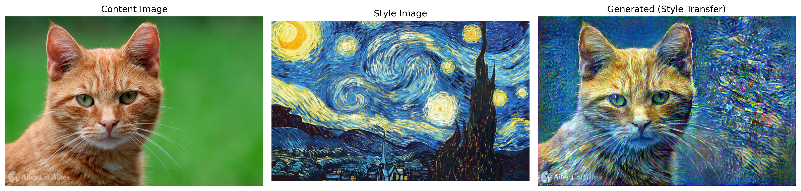

# Project 3: Neural Style Transfer

Implementation of artistic style transfer using the optimization-based approach from Gatys et al. (2015). This project demonstrates a fundamentally different paradigm: instead of training network weights, we optimize the image itself to match content and style targets.

## 🎯 Objective

Combine the **content** of one image with the **style** of another by optimizing pixel values directly. This showcases how pre-trained networks can be used as fixed feature extractors for creative applications.

**Key concept:** The network (VGG19) is frozen. We optimize the **input image** to minimize a loss function that balances content preservation and style matching.

## 🎨 Results



**Content:** Cat portrait

**Style:** "The Starry Night" by Vincent van Gogh

**Result:** Cat rendered with Van Gogh's distinctive swirling brushstrokes and color palette

## 🏗️ Architecture & Approach

### Traditional Training vs. Style Transfer

**Traditional (MLP, CNN):**

```
Input (fixed) → Network (trainable) → Output
                    ↓
            Optimize weights via backprop
```

**Style Transfer:**

```
Input (optimized) → Network (fixed, pre-trained VGG19) → Features
       ↓                                                     ↓
Optimize pixels                                    Calculate loss
```

### VGG19 as Feature Extractor

We use a pre-trained VGG19 network (trained on ImageNet) to extract features at multiple layers:

**Content representation:**

- Layer: `conv4_2` (deep layer capturing high-level structure)
- Directly compares feature activations

**Style representation:**

- Layers: `conv1_1, conv2_1, conv3_1, conv4_1, conv5_1` (multiple depths)
- Compares **Gram matrices** (correlations between feature maps)

### The Gram Matrix

**Key insight:** Style is the **correlation between features** , not the features themselves.

For a feature map with shape `(B, C, H, W)`:

```python
# Reshape: (B, C, H, W) → (B, C, H×W)
F_flat = features.view(B, C, H*W)

# Gram matrix: (B, C, C) = correlations between all channel pairs
G = torch.matmul(F_flat, F_flat.transpose(1, 2))
```

**What `G[i,j]` represents:**

- High value → feature maps `i` and `j` co-occur frequently (characteristic pattern)
- Low value → features are independent

**Why this captures style:**

- Gram matrix is **position-agnostic** → captures "what patterns exist" not "where they are"
- Content is "where objects are", style is "how they're painted"
- By matching Gram matrices, we transfer texture/brushwork without transferring object positions

## 🔬 Implementation Details

### Loss Functions

**Content Loss:**

```python
L_content = MSE(features_gen['conv4_2'], features_content['conv4_2'])
```

Ensures the generated image has the same high-level structure as the content image.

**Style Loss:**

```python
L_style = Σ MSE(Gram(features_gen[layer]), Gram(features_style[layer]))
          for layer in ['conv1_1', 'conv2_1', 'conv3_1', 'conv4_1', 'conv5_1']
```

Ensures the generated image has the same texture correlations as the style image across multiple scales.

**Total Loss:**

```python
L_total = alpha × L_content + beta × L_style
```

### Hyperparameters

| Parameter         | Value | Role                                   |
| ----------------- | ----- | -------------------------------------- |
| **alpha**         | 1e7   | Weight for content preservation        |
| **beta**          | 1.0   | Weight for style matching              |
| **num_steps**     | 300   | Optimization iterations                |
| **learning_rate** | 0.01  | Adam optimizer step size               |
| **image_size**    | 512   | Max dimension for content/style images |

### Why We Don't Normalize the Gram Matrix

Initial implementation included `G = G / (C * H * W)`, but this creates scale imbalances:

- `conv1_1`: `(64, 256, 256)` → normalize by 4,194,304
- `conv5_1`: `(512, 16, 16)` → normalize by 131,072

Layers with more pixels contribute **disproportionately less** to the loss. Removing normalization allows all layers to contribute more equally to style representation.

### Balancing Content and Style

**Challenge:** Raw loss magnitudes differ by ~8 orders of magnitude:

```
Content loss: ~1-10
Style loss:   ~100,000,000
```

**Solution:** Use alpha/beta to balance contributions to total loss:

```
With alpha=1e7, beta=1.0:
  alpha × content ≈ 15,000,000   (9% of total)
  beta × style    ≈ 150,000,000  (91% of total)
```

Even though style dominates numerically, content loss provides strong gradients when content is threatened, creating a natural equilibrium.

**Tuning guidelines:**

- Higher alpha/beta ratio → more content preservation, subtle style
- Lower alpha/beta ratio → aggressive style transfer, less recognizable content
- Typical range: alpha/beta ∈ [1e6, 1e8]

## 💻 Code Structure

### VGG Feature Extractor

```python
class VGGFeatureExtractor(nn.Module):
    def __init__(self):
        # Load pre-trained VGG19
        vgg = models.vgg19(pretrained=True).features

        # Define which layers to extract
        self.layer_indices = {
            'conv1_1': 0, 'conv2_1': 5, 'conv3_1': 10,
            'conv4_1': 19, 'conv4_2': 21, 'conv5_1': 28
        }

        # Freeze all parameters
        for param in self.parameters():
            param.requires_grad = False
```

**Key decision:** Extract features at specific indices by iterating through VGG's sequential layers, saving outputs when we hit target indices.

### Optimization Loop

```python
# Initialize from content image (preserves structure)
gen_img = content_img.clone().requires_grad_(True)

# Optimizer operates on IMAGE PIXELS, not network weights!
optimizer = optim.Adam([gen_img], lr=0.01)

for step in range(num_steps):
    # Extract features from generated image
    gen_features = vgg(gen_img)

    # Compute losses
    c_loss = content_loss(gen_features, content_features)
    s_loss = style_loss(gen_features, style_features, style_layers)
    total_loss = alpha * c_loss + beta * s_loss

    # Backward pass computes ∂loss/∂pixels
    optimizer.zero_grad()
    total_loss.backward()
    optimizer.step()

    # Clamp pixels to valid range [0, 1]
    with torch.no_grad():
        gen_img.clamp_(0, 1)
```

**Critical details:**

- `gen_img.requires_grad = True` → treat image as learnable parameter
- `optimizer.zero_grad()` → same workflow as training, but optimizing different variables
- `torch.no_grad()` for clamping → don't include this operation in computational graph
- Clamping prevents invalid pixel values (optimizer doesn't know pixels must be in [0, 1])

## 🧠 What I Learned

### Conceptual Breakthroughs

**1. Networks as measurement tools**

- Pre-trained networks aren't just for classification
- They're hierarchical feature extractors capturing texture, shapes, semantics
- Can be "frozen" and repurposed for creative applications

**2. Optimization beyond parameter learning**

- Backprop works on **any** differentiable variable with `requires_grad=True`
- Can optimize inputs, activations, or even architecture parameters
- Opens door to adversarial examples, neural architecture search, etc.

**3. Separating content and style**

- **Content** = activations at deep layers (what + where)
- **Style** = correlations between features (how, independent of where)
- Gram matrix is elegant solution to position-invariant texture matching

### Technical Insights

**Feature hierarchy in CNNs:**

- Early layers (`conv1_1`) → edges, colors, simple textures
- Middle layers (`conv3_1`) → patterns, object parts
- Deep layers (`conv4_2, conv5_1`) → high-level objects, scenes

Style transfer works by matching patterns across **all** levels simultaneously.

**Loss balancing is crucial:**

- Raw loss magnitudes are misleading (content ~1, style ~100M)
- What matters is **gradient contributions** to optimization
- alpha/beta control trade-off, not absolute loss values
- Finding good alpha/beta requires experimentation per image pair

**Computational efficiency:**

- Content/style features computed once (they don't change)
- Only `gen_img` features recomputed each iteration
- VGG forward pass is the bottleneck (~95% of time)
- GPU acceleration critical: 4 seconds vs ~5 minutes on CPU

## 🔧 Running the Code

### Prerequisites

```bash
cd pytorch-fundamentals/03_style_transfer
```

### Prepare Images

1. Download a content image (your photo, landscape, portrait)
2. Download a style image (artwork from [WikiArt](https://www.wikiart.org/))
3. Place in `images/content/` and `images/style/`

### Run Style Transfer

```python
from models.vgg_extractor import VGGFeatureExtractor
from utils.losses import content_loss, style_loss, gram_matrix
import torch
import torch.optim as optim

# Load images
content_img = load_image('images/content/photo.jpg').to(device)
style_img = load_image('images/style/painting.jpg').to(device)

# Extract features (once)
vgg = VGGFeatureExtractor().to(device).eval()
content_features = vgg(content_img)
style_features = vgg(style_img)

# Initialize and optimize
gen_img = content_img.clone().requires_grad_(True)
optimizer = optim.Adam([gen_img], lr=0.01)

for step in range(300):
    gen_features = vgg(gen_img)

    c_loss = content_loss(gen_features, content_features)
    s_loss = style_loss(gen_features, style_features, style_layers)
    total_loss = 1e7 * c_loss + 1.0 * s_loss

    optimizer.zero_grad()
    total_loss.backward()
    optimizer.step()

    with torch.no_grad():
        gen_img.clamp_(0, 1)

# Save result
save_image(gen_img, 'results/output.png')
```

## 🎨 Experiments & Variations

### Tuning the Style Intensity

```python
# Subtle style (content-heavy)
alpha, beta = 1e8, 1.0

# Balanced
alpha, beta = 1e7, 1.0

# Aggressive style (style-heavy)
alpha, beta = 1e6, 1.0
```

### Different Style Artists

Try various artistic styles:

- **Impressionism:** Monet, Renoir (soft, colorful)
- **Expressionism:** Van Gogh, Munch (bold, emotional)
- **Cubism:** Picasso (geometric, abstract)
- **Abstract:** Kandinsky (non-representational patterns)

### Advanced Variations (Not Implemented)

- **Multiple style images:** Blend styles from several artworks
- **Spatial style control:** Apply different styles to different regions
- **Video style transfer:** Maintain temporal coherence across frames
- **Real-time style transfer:** Train feed-forward network (Fast Style Transfer)

## 📊 Performance

**Optimization time:**

- GPU (RTX 5070 Ti): ~4 seconds for 300 steps at 512×512
- CPU: ~5 minutes for 300 steps

**Memory usage:**

- ~2GB GPU memory for 512×512 images
- Scales with image resolution (O(H²×W²))

## 🔮 Future Improvements

- [ ] **Automatic alpha/beta tuning:** Normalize losses to [0, 1] range initially
- [ ] **Progressive refinement:** Start with low resolution, upscale gradually
- [ ] **Content mask:** Preserve specific regions (e.g., faces) more strongly
- [ ] **Style interpolation:** Blend multiple artistic styles with weights
- [ ] **Perceptual improvements:** Total variation loss to reduce noise
- [ ] **Video support:** Temporal consistency constraints for video frames

## 📚 References

- [Gatys et al., 2015 - A Neural Algorithm of Artistic Style](https://arxiv.org/abs/1508.06576)
- [Johnson et al., 2016 - Perceptual Losses for Real-Time Style Transfer](https://arxiv.org/abs/1603.08155)
- [Simonyan &amp; Zisserman, 2014 - VGG Networks](https://arxiv.org/abs/1409.1556)
- [Original VGG19 Implementation](https://www.robots.ox.ac.uk/~vgg/research/very_deep/)

## 🎓 Key Takeaways

1. **Pre-trained networks are versatile tools:** Don't just think of them as classifiers—they're feature extractors that understand visual concepts at multiple scales
2. **Optimization goes beyond training:** The same backprop machinery that trains models can optimize inputs, enabling creative applications like style transfer and adversarial examples
3. **Loss design encodes domain knowledge:** The choice to use Gram matrices for style wasn't arbitrary—it's a principled way to capture texture while ignoring spatial layout
4. **Balancing competing objectives is an art:** There's no formula for perfect alpha/beta—it requires experimentation and visual judgment
5. **GPU acceleration matters:** 4 seconds vs 5 minutes isn't just convenience—it enables interactive experimentation that's impossible on CPU

---

[← Back to main repository](https://claude.ai/README.md)
